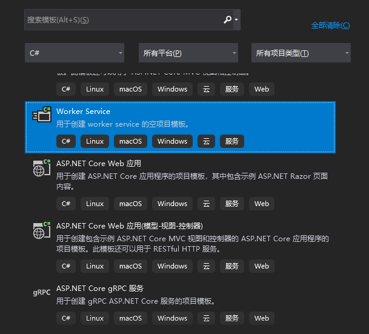
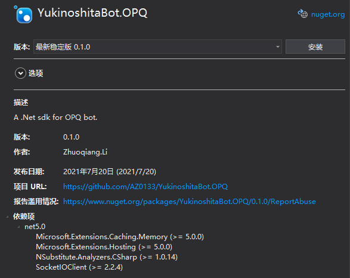
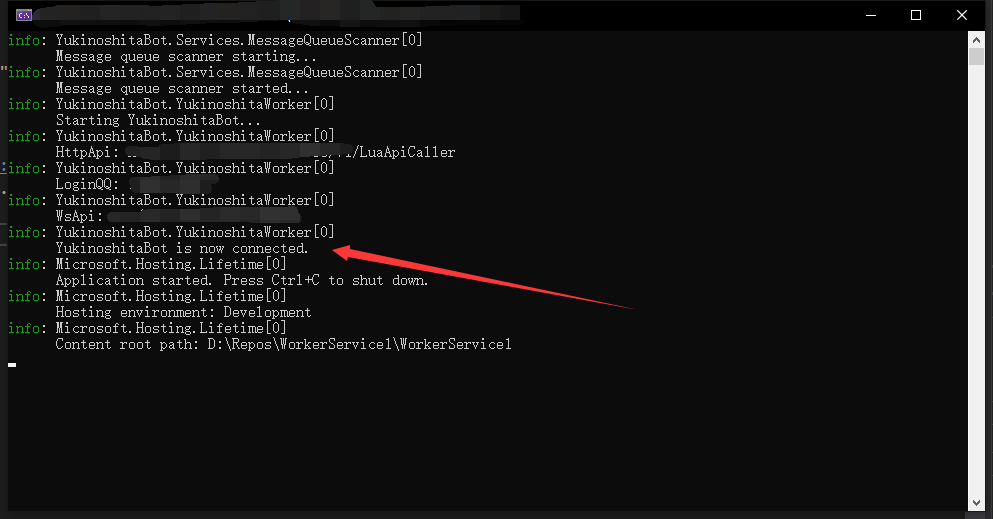
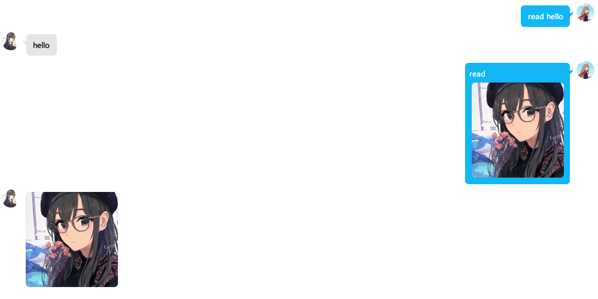
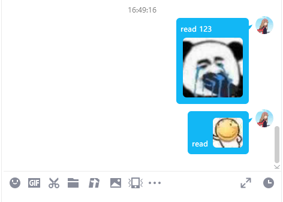
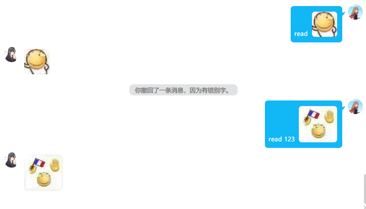

# YukinoshitaBot.OPQ
这是一个基于[OPQ](https://github.com/opq-osc/OPQ)的QQ机器人SDK，使用.net5开发

### 由于OPQ切换到QQ-NT，本项目已废弃。请使用支持新OPQ框架的新项目: [YukinoshitaBot.OPQ-NT](https://github.com/opq-osc/YukinoShitaBot.OPQ-NT)
---
## 特性
- 作为服务注入到IOC容器中，方便集成到已有项目
- 类似Asp.Net Core的MVC架构，使用Controller编写业务逻辑
- Controller支持依赖注入
- 支持状态缓存，可以缓存好友或群会话上下文

## 快速开始
本节将介绍本框架的基本使用方法，完成后你将获得一个复读机器人

### 创建项目
1.打开Visual Studio 2019，选择 **Worker Serice** 项目模板，(如下图)并建立一个新项目。目标框架选择 **.Net5**。

> 你也可以使用控制台应用程序并手动配置Host，或者使用Asp.Net等自带Host的模板。总之，我们需要一个Host来承载Bot服务。



2.点击 **项目->管理Nuget程序包**，在 **浏览** 选项卡中搜索 **Yukinoshita.OPQ** 并安装，如下图。



### 配置项目
1.打开 **Program.cs**，在using区域添加命名空间导入：
```csharp
using YukinoshitaBot.Extensions;
```
2.删除 **Worker.cs** 文件，将 **Program.cs** 中 **CreateHostBuilder** 方法中的 *`services.AddHostedService<Worker>()`* 改为 *`services.AddYukinoshitaBot()`*.修改之后的代码应该长这样：
```csharp
    public class Program
    {
        public static void Main(string[] args)
        {
            CreateHostBuilder(args).Build().Run();
        }

        public static IHostBuilder CreateHostBuilder(string[] args) =>
            Host.CreateDefaultBuilder(args)
                .ConfigureServices((hostContext, services) =>
                {
                    services.AddYukinoshitaBot();
                });
    }
```
3.打开 **appsettings.json**，将内容以替换为以下模板：
```json
{
  "Logging": {
    "LogLevel": {
      "Default": "Information",
      "Microsoft": "Warning",
      "Microsoft.Hosting.Lifetime": "Information"
    }
  },
  "OpqApiSettings": {
    "HttpApi": "http://localhost:8888/v1/LuaApiCaller",
    "WebSocketApi": "ws://localhost:8888",
    "LoginQQ": "123456"
  },
  "MsgQueueSettings": {
    "DelayAfterSent": 1000,
    "Capacity": 100
  }
}
```
将 **LoginQQ** 替换为OPQ登录的QQ号，如果你的OPQ不是部署在localhost，或者你修改了端口，请修改 **HttpApi** 和 **WebSocketApi** 中的地址和端口

4.运行项目，如果你能够看到如下图所示的连接成功信息，说明到目前为止你的配置是成功的。如果编译出错，请检查是否添加了 **Yukinoshita.OPQ** 包，是否添加了命名空间；如果没有出现连接成功信息，请查看控制台输出，检查HttpApi、LoginQQ、WsApi三个值是否为预期，并检查appsettings.json的格式。若配置无误，请检查OPQ是否启动并登录，若部署于服务器，请检查服务器防火墙配置。准备就绪后，我们就要开始编写复读机代码了。



### 实现复读机
不同于其它框架使用的事件传递方式，**YukinoshitaBot**使用控制器处理消息，弱化了群消息、私聊消息的区别，而专注于消息内容，提供一致化的处理方法。即使不理解这段话的含义也没关系，随着了解的深入，你会逐渐理解**YukinoshitaBot**的思想。多说无益，干就完了！

1.新建Controllers文件夹

点击 **项目->新建文件夹**，将新文件夹命名为 **Controllers**
> 你也可以使用其它文件夹，或者不新建文件夹。但我们建议将所有Controller统一放在Controllers文件夹中，便于维护。

2.新建Controller

在Controllers文件夹中新建一个类，命名为 **RepeaterController**，并添加以下命名空间：
```csharp
using YukinoshitaBot.Data.Attributes;
using YukinoshitaBot.Data.Event;
using YukinoshitaBot.Data.OpqApi;
```
接着为 **RepeaterController** 添加 **YukinoshitaController** 注解，它看起来是这样的：
```csharp
[YukinoshitaController(Priority = 1, Mode = HandleMode.Break, SessionType = SessionType.Person)]
public class RepeaterController
{
    
}
```
>**YukinoshitaController** 这个注解（C#中称为**Attribute**）规定了RepeaterController的一些属性和行为。本框架使用注解来识别Controller，因此注解是必须的。

下面对注解中的参数进行简单解释：
- **Priority**：优先级。YukinoshitaBot允许编写多个控制器，在收到消息时，会将消息传递给所有匹配的控制器进行处理，而传递会按照优先级顺序进行。数字越小，优先级越高。需要注意的是，优先级的值 **不可以重复**，也就是说 **不可以将两个控制器配置为相同的优先级，否则控制器会被覆盖**。
- **Mode**：处理模式。处理模式有两种，**Break**表示消息在本控制器中处理过后，将不再向后面的控制器传递； **Pass**则会继续向后传递。结合优先级可以实现消息的拦截、过滤、记录等功能。
- **SessionType**：将在其它主题中详细说明，此处无需关心。

现在我们只有一个控制器，因此无论如何配置参数，都不会有任何作用。因此先简单了解这些参数有什么用即可。

3.添加处理方法

在**RepeaterController**中添加两个方法，代码如下：
```csharp
[YukinoshitaHandler(Command = "read ", MatchMethod = CommandMatchMethod.StartWith, Mode = HandleMode.Break, Priority = 1)]
public void TextRepeater(Message message)
{
    if (message is TextMessage textMsg)
    {
        message.Reply(new TextMessageRequest(textMsg.Content[5..]));
    }
}

[YukinoshitaHandler(Command = "read", MatchMethod = CommandMatchMethod.StartWith, Mode = HandleMode.Break, Priority = 2)]
public void PictureRepeater(Message message)
{
    if (message is PictureMessage picMsg)
    {
        message.Reply(new PictureMessageRequest(new Uri(picMsg.FirstPicture)));
    }
}
```

这里同样用到了注解。相比于控制器，方法注解有两个额外的参数：
- **Command**：与该Command匹配的消息将会被传入本方法进行处理
- **MatchMethod**：匹配模式。支持的匹配模式有：
    - **StartWith**：以Command开头的消息
    - **Strict**：消息文本与Command完全一致
    - **Regex**：Command作为正则表达式对消息进行匹配

因此TextRepeater将会接收到以 "read " 开头的消息，在方法体中，我们使用了模式匹配，当接收到的消息类型为文本消息时，截取消息从第六个字符开始的部分进行回复，也就是说如果机器人接收到"read 123"，将会回复"123"。

而PictureRepeater也是类似的，不同的是我们在其中匹配的是图片类型的消息，获取消息中的第一张图片作为回复。如果接收到"read+图片"，机器人将会回复其中的图片。

此处需要注意的是，如果消息以"read空格"开头，那一定也满足以"read"开头的条件。因此在配置优先级的时候，我们将文本和图片复读的优先级分别设置为1和2，并都配置为截断处理，这样消息的处理路径是最短的。

4.运行程序，通过 **好友/群/临时会话** 向机器人发送消息，都会获得响应，如下图



### 一点问题
虽然已经实现了复读，但这里有一个问题：如果发送的是图片复读消息，但不小心在read后面多打了一个空格，机器人会回复什么？或者干脆发送"read 123+图片"，机器人如何回复？

显然，在以上代码中，由于"read "的优先级高于"read"，这些消息都会被TextRepeater优先获取到。而我们发送的这两条消息都是图片消息，因此消息不会被TextMessage类型所匹配，那么TextRepeater虽然接收到了消息，但不会做任何事情；之后，由于TextRepeater设置的处理模式为Break，消息不会继续向更低优先级的方法传递，所以PictureRepeater不会接收到消息。最终结果是机器人不会对这两条消息进行回复，如下图所示。



要修复也很简单，只需要将TextRepeater的处理模式由 **Break** 改为 **Pass**，这样在它处理完消息后，消息继续向下传递，若消息与PictureRepeater是匹配的，则PictureRepeater也会接收到消息并进行处理，如下图所示。



希望能够对你理解优先级与处理模式能够有所帮助。

## 详细文档正在更新中...
